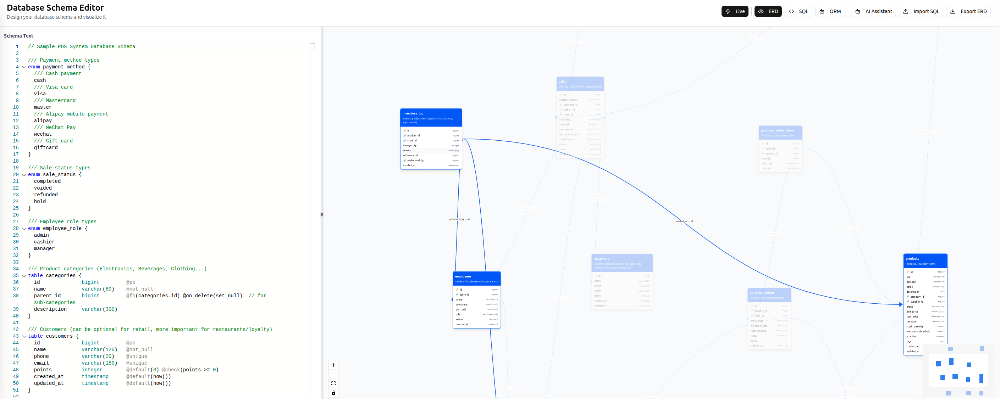
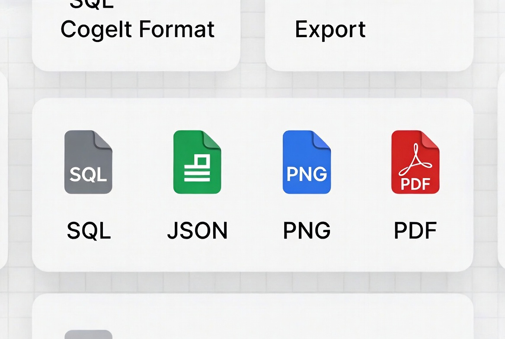

# db-weave

**Design PostgreSQL schemas visually with a simple text DSL.**

db-weave lets you define database schemas in a human-readable text format, instantly visualize them as interactive ERDs, and export to SQL, JSON, PNG, or PDF. It includes AI-assisted schema generation and ORM code output for Prisma, TypeORM, Sequelize, and GraphQL.



## Features

- **Custom Text DSL** — Define tables, columns, types, constraints, and relationships in a clean, readable syntax powered by a Peggy parser
- **Interactive ERD** — Auto-layout with ELK/Dagre algorithms, hover to highlight relationships, pan/zoom
- **SQL Import & Generation** — Import existing PostgreSQL schemas or generate CREATE statements from your DSL
- **Multi-format Export** — Export diagrams and schemas as SQL, JSON, PNG, or PDF
- **ORM Code Generation** — Generate Prisma, TypeORM, Sequelize, and GraphQL type definitions from your schema
- **AI-Assisted Design** — Use OpenAI to generate and optimize schemas from natural language descriptions
- **Live Preview** — Real-time parsing and visualization as you type with Monaco editor
- **Comprehensive Error Reporting** — Parse errors with line and column information



## Quick Start

### Prerequisites

- [Node.js](https://nodejs.org/) v20+ (LTS recommended)
- [pnpm](https://pnpm.io/) package manager

### Installation

```bash
# Clone the repository
git clone https://github.com/your-username/db-weave.git
cd db-weave

# Install dependencies
cd db-weave-app && pnpm install && cd ..
cd api-server && pnpm install && cd ..
```

### Configuration

Create environment files for each package:

```bash
# api-server/.env
PORT=3001
OPENAI_API_KEY=your-openai-api-key    # Required for AI features
CLERK_SECRET_KEY=your-clerk-secret     # Required for authentication
```

```bash
# db-weave-app/.env
VITE_API_URL=http://localhost:3001
VITE_CLERK_PUBLISHABLE_KEY=your-clerk-key  # Required for authentication
```

### Running

```bash
# Start both frontend and backend
./start-dev.sh

# Or start them individually:
# Terminal 1 - API server
cd api-server && pnpm dev

# Terminal 2 - Frontend
cd db-weave-app && pnpm dev
```

The app will be available at `http://localhost:3000` with the API at `http://localhost:3001`.

## DSL Syntax

db-weave uses a simple text format to define database schemas:

```
// Line comments
/// Table description (doc comment)
table users {
  id          bigint       @pk
  name        varchar(100) @not_null
  email       varchar(255) @unique
  role        varchar(30)  @default('user')
  is_active   boolean      @default(true)
  created_at  timestamp    @default(now())
}

table posts {
  id          bigint       @pk
  title       varchar(255) @not_null
  content     text
  user_id     bigint       @fk(users.id) @not_null
  created_at  timestamp    @default(now())
}
```

### Supported Annotations

| Annotation | Description |
|---|---|
| `@pk` | Primary key |
| `@not_null` | NOT NULL constraint |
| `@unique` | Unique constraint |
| `@default(value)` | Default value (`now()`, literals, booleans) |
| `@fk(table.column)` | Foreign key reference |

### Supported Types

`bigint`, `integer`, `smallint`, `serial`, `bigserial`, `varchar(n)`, `char(n)`, `text`, `boolean`, `decimal(p,s)`, `numeric(p,s)`, `real`, `double`, `date`, `timestamp`, `timestamptz`, `time`, `uuid`, `json`, `jsonb`, `bytea`

## Project Structure

```
db-weave/
├── db-weave-app/          # React frontend (Vite + TanStack Router)
│   └── src/
│       ├── components/    # UI components (shadcn/ui)
│       ├── lib/
│       │   └── dsl/       # DSL parser, grammar, generators
│       ├── api/           # API client
│       └── routes/        # Page routes
├── api-server/            # Express backend
│   └── src/
│       ├── server.ts      # Entry point
│       ├── routes/        # API routes
│       └── orm-integrations/  # ORM code generators
├── start-dev.sh           # Dev startup script
└── example.txt            # Sample POS system schema
```

## Tech Stack

**Frontend:** React 19, Vite, TanStack Router, Tailwind CSS, shadcn/ui, React Flow (XY Flow), Monaco Editor, ELK.js

**Backend:** Node.js, Express, TypeScript, Zod

**Parser:** Peggy (PEG parser generator)

**AI:** OpenAI via Vercel AI SDK

**Auth:** Clerk

## Contributing

Contributions are welcome! Please follow these steps:

1. Fork the repository
2. Create a feature branch (`git checkout -b feat/your-feature`)
3. Commit your changes using [conventional commits](https://www.conventionalcommits.org/) (`feat:`, `fix:`, `docs:`, etc.)
4. Push to your branch (`git push origin feat/your-feature`)
5. Open a Pull Request

### Development

```bash
# Run tests
cd db-weave-app && pnpm test

# Rebuild the DSL grammar after changes
cd db-weave-app && pnpm grammar:build

# Lint and format
cd db-weave-app && pnpm lint && pnpm format
```

## Roadmap

- [ ] Schema templates (e-commerce, blog, SaaS, etc.)
- [ ] Advanced schema validation and best practice recommendations
- [ ] Real-time collaboration and schema sharing
- [ ] Schema versioning and migration generation
- [ ] Live PostgreSQL database introspection
- [ ] Query performance suggestions and index recommendations
- [ ] Auto-generated schema documentation

## License

This project is licensed under the [MIT License](LICENSE).

## Acknowledgments

- [Peggy](https://peggyjs.org/) — Parser generator for the DSL grammar
- [React Flow](https://reactflow.dev/) — Interactive diagram rendering
- [ELK.js](https://github.com/kieler/elkjs) — Automatic graph layout
- [Monaco Editor](https://microsoft.github.io/monaco-editor/) — Code editor component
- [shadcn/ui](https://ui.shadcn.com/) — UI component library
